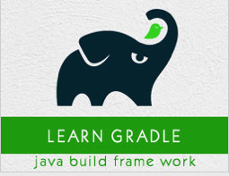

```
Roberto Nogueira  
BSd EE, MSd CE
Solution Integrator Experienced - Certified by Ericsson
```
# TutorialsPoint Gradle



**About**

`Gradle` is an open source, advanced general purpose build management system. It is built on ANT, Maven, and lvy repositories. It supports Groovy based Domain Specific Language (DSL) over XML. This tutorial explains how you can use Gradle as a build automation tool for Java as well as Groovy projects.

[Homepage](http://www.tutorialspoint.com/gradle/)

## Topics
```
Gradle Tutorial
[x] Home
[x] Overview
[x] Installation
[ ] Build Script
[ ] Tasks
[ ] Dependency Management
[ ] Plugins
[ ] Running a Build
[ ] Build a JAVA Project
[ ] Build a Groovy Project
[ ] Testing
[ ] Multi-Project Build
[ ] Deployment
[ ] Eclipse Integration
Gradle Useful Resources
[ ] Quick Guide
[ ] Useful Resources
[ ] Discussion
Selected Reading
[ ] Developer's Best Practices
[ ] Questions and Answers
[ ] Effective Resume Writing
[ ] HR Interview Questions
[ ] Computer Glossary
[ ] Who is Who
```
